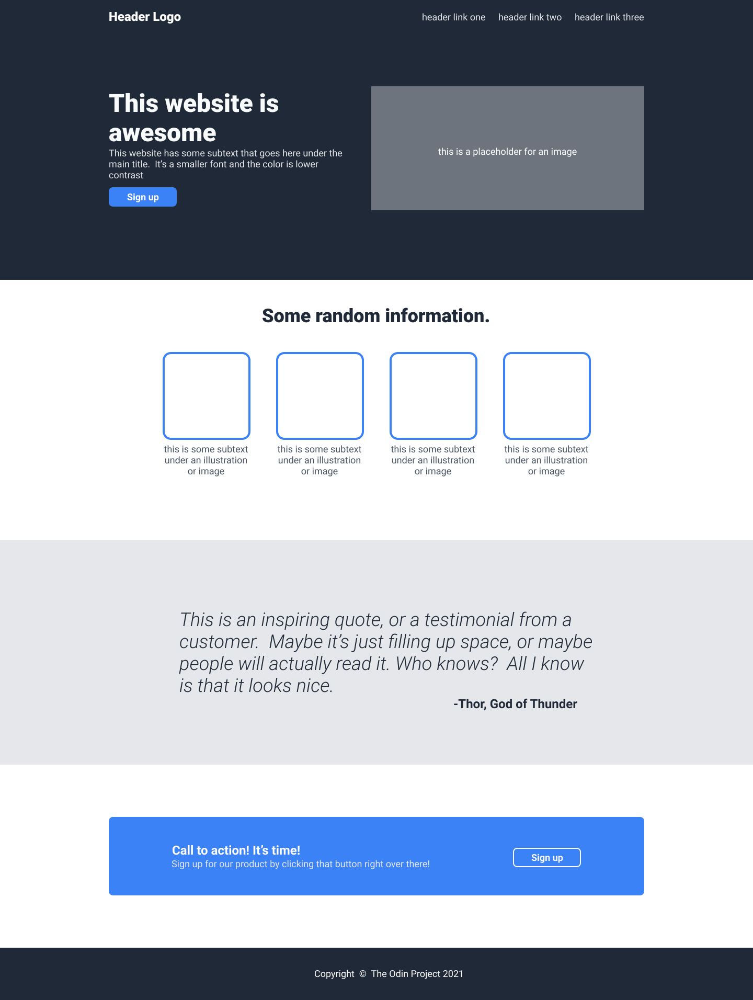

# Colonia - Fan Webpage

This is my first full web development project, for which I decided to make a fan webpage about the Croatian eurodance group Colonia. The site is fully in Croatian, but this README is in English for a wider audience.

**NOTE:** This project is not yet finished.

The first commit of this page was built on top of this template.

 

This template is recommended by The Odin Project as the final landing page project of the Foundations course. I didn't like the first design of my page, so I took matters into my own hands, and I'm now building a full webpage exactly the way I want it to look. This is a project where I put the HTML and CSS skills I've gained so far through The Odin Project and freeCodeCamp to the best possible use.

## Inspiration

Colonia is a eurodance group from Croatia that stood out on the local and European eurodance scene during the late '90s and early 2000s. For the design, I chose a dark crimson/red color palette, which represents the eurodance/2000s vibe.